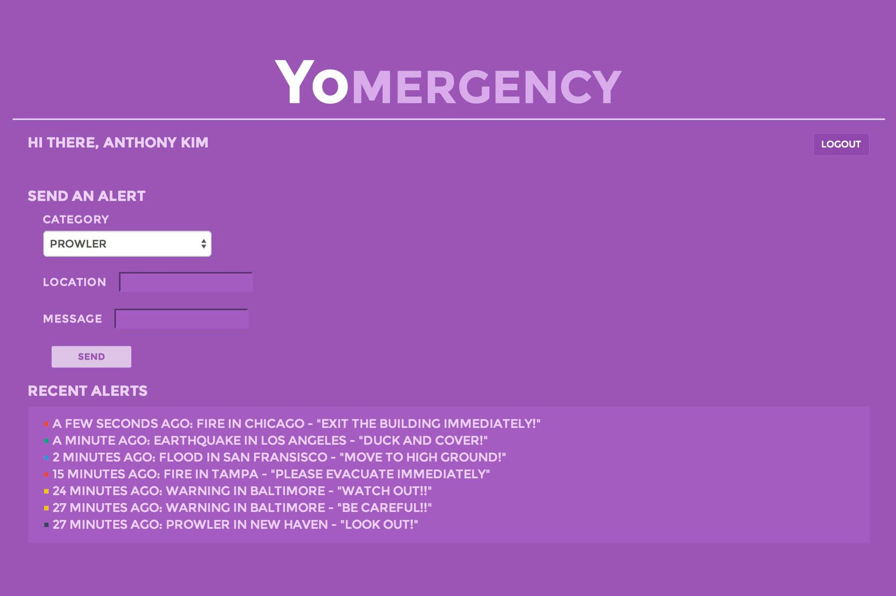
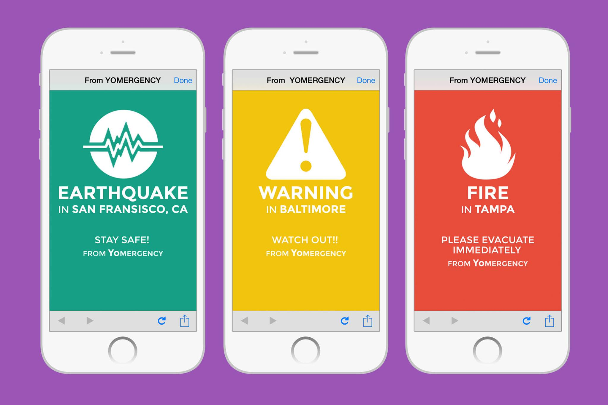

# yomergency


Fire! Flood! Blizzard! Earthquake! Natural and human-made disasters are all too frequent. To make matters worse, mass communication is challenging -- there's no great way to quickly notify 1,000 people about the flood soaring through the streets.

We have the solution. During a disaster, yomercency sends Yos to all those subscribed to the `YOMERGENCY` channel. These Yos contain the type of disaster along with a graphic, the location, and a quick message describing the disaster.

When there's an emergency, a local administrator logs into our admin panel with their Facebook account.


On the main page, the admin describes the disaster with a type, location, and message. With one click of a button sends a Yo to all those subscribed to the `YOMERGENCY` channel.



All subscribers then receive a Yo from `YOMERGENCY`. When they open the notification, they are taken to our website. Our site will show them a graphic, the type of disaster, the location and the message.



## Technical Details

Yomergency is an Express-based application using MongoDB. Yomergency is currently deployed on Heroku: [http://yomergency.herokuapp.com](http://yomergency.herokuapp.com) and uses [Travis CI](https://travis-ci.org/charlierproctor/yomergency) for continuous integration.

Yomergency uses [Bootstrap](https://github.com/twbs/bootstrap/) as a CSS framework and EJS for the templating language, as well as the following JS packages:

- [Passport](https://github.com/jaredhanson/passport) for Login via Facebook
- [Node Yo-API](https://github.com/sakatam/node-yo-api) wrapper
- [Mongoose](https://github.com/learnboost/mongoose/) to interface with MongoDB
	- [mongoose-timestamp](https://github.com/drudge/mongoose-timestamp) for createdAt / updatedAt timestamps
- [Moment.js](https://github.com/moment/moment/) for date/time formatting
- [express-session](https://github.com/expressjs/session) for session-storage

## Quick Start

Install necessary packages: 
	
``` 
$ npm install
```

Start the server: 
	
``` 
$ npm start
```

## Team

Yomergency was built at [YHack 2014](http://yhack.org) by:

| Name | GitHub |
|------|--------|
| John Chirikjian | [jchirik](https://github.com/jchirik) |
| Anthony Kim | [ak3703](https://github.com/ak3703)
| Charlie Proctor | [charlierproctor](https://github.com/charlierproctor)
